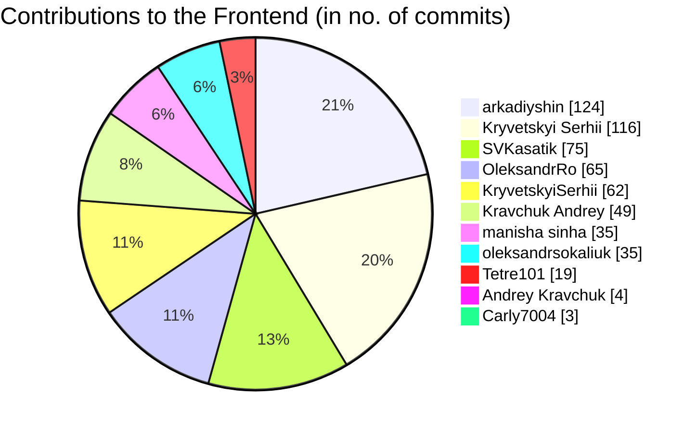
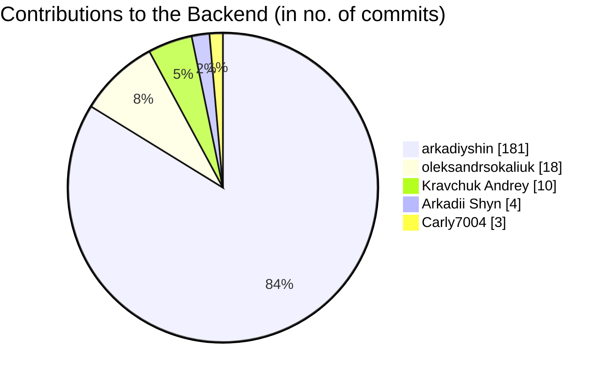

<sup>(1) Modern design: [Figma](https://www.figma.com/file/nYlgCL7yWXHEcpTHgwzYgu/Untitled?node-id=0%3A1) - check page 1 and page 2</sup>  
<sup>(2) Todo-based concept: [states](https://github.com/WildCodeSchool/2022-07-EN-Berlin-Remote1-Project3Planning/blob/main/PLANNING.md#de-cluettering-case-states)/[analysis](https://github.com/WildCodeSchool/2022-07-EN-Berlin-Remote1-Project3Planning/blob/main/ui_concept_todos.md)</sup>
# WCS & REMONDIS GROUP

This project is the result of a joint collaboration between _Wild Code School_ and _REMONDIS Group_

A group of 8 students worked along with their instructor to conceptualise and get as close as possible to building a working mobile app for REMONDIS' de-cluttering companies/partners

## Contributors





## State of Application

The application is at a _Proof of Concept_ (POC) stage with some _real_ and some _mocked_ features. The definition of either feature category can be found below:
1. _Real features:_ these are features that are implemented using a backend, hence, the data provided to these features of the application are stored/persisted in a database.
1. _Mocked features:_ these are features that are implemented without a backend, the data provided to these features, hence, will be lost when refreshing the page.

For a detailed account of which features in this POC application are real and which are mocked, please check the [final presentation here](https://wildcodeschool.github.io/2022-07-EN-Berlin-Remote1-Project3Presentation/).

The presentation is a WIP, it will be finalized before the final demo on the graduation day (30.11.2022).

## Use Instructions

Below you will find instructions on how to run the fullstack application including both the backend and the frontend, locally on your machine.

### Requirements

These steps will work on a Windows, Mac OS or a Linux computer, given that NodeJS 16.x is installed, preferably using a _Node Version Manager_ or `nvm`

### BEFORE YOU BEGIN

Before attempting to run the backend part of the application, you will need the `.env` secrets file to be shared with you. Please send a request to the teacher at "orwa.diraneyya@wildcodeschool.com"

---
### Launching the Backend

> Remember to ask for the secrets `.env` file before starting these steps

Please find the steps to launch the backend below (note that you will need a secrets or a `.env` file):

1. Clone the [backend](https://github.com/WildCodeSchool/2022-07-EN-Berlin-Remote1-Project3Backend) repository, preferably to a folder named `REMONDISBackend` and `cd` into it as follows:
    ```bash
    git clone git@github.com:WildCodeSchool/2022-07-EN-Berlin-Remote1-Project3Backend.git REMONDISBackend
    cd REMONDISBackend
    ```
1. If using a version of NodeJS other than 16.x (for example, version 14 or 18), then use `nvm` to install and/or switch to the recommended version:
    ```bash
    nvm install 16
    nvm use 16
    ```
1. Install the dependencies (run this command from the root of the `REMONDISBackend` directory):
    ```bash
    npm i
    ```
1. Store the `.env` file given to you (containing the secrets) at the root of the `REMONDISBackend` directory.
    > _NOTE:_ the variable `FRONTEND_URL` in the secrets `.env` file contains the URL pointing to the frontend, for example, when running the frontend locally, this is likely to be `http://localhost:3000`
1. Run `npm start` to build and start the backend, also called the server.
1. In another console window, navigate to `REMONDISBackend` and run the following command to explore the data in the local/remote database (this is the database with the _connection string_ in the `DATABASE_URL` variable in the secrets `.env` file):
    ```bash
    npx prisma studio
    ```
1. In case the command above did not work, run the following command first, then try again:
    ```bash
    npx prisma migrate dev
    ```

### Backend: create or migrate database

For creating or migrating the database to a new location, change the `DATABASE_URL` variable in the secrets `.env` file to contain the _connection string for the new database location,_ then run following command:
```bash
npx prisma migrate dev
```


For more details, please refer to the [README](https://github.com/WildCodeSchool/2022-07-EN-Berlin-Remote1-Project3Backend/blob/main/README.md) of the backend project on GitHub.


---
### Launching the Frontend

Please find the steps to launch the frontend, note that some of the steps are similar to the steps done when launching the backend:

1. Clone the [frontend](https://github.com/WildCodeSchool/2022-07-EN-Berlin-Remote1-Project3Frontend) repository, preferably to a folder named `REMONDISFrontend` and `cd` into it:
    ```bash
    git clone git@github.com:WildCodeSchool/2022-07-EN-Berlin-Remote1-Project3Frontend.git REMONDISFrontend
    cd REMONDISFrontend
    ```
1. If using a version of NodeJS other than 16.x (for example, 14 or 18), use `nvm` to install and/or switch to the right version:
    ```bash
    nvm install 16
    nvm use 16
    ```
1. Install the dependencies (run this command from the `REMONDISFrontend` directory):
    ```bash
    npm i
    ```
1. Create a blank secrets file at the root of the `REMONDISFrontend` directory, name the file `.env` and add the following line to it:
    ```
    REACT_APP_BASE_API_URL=http://localhost:4000
    ```
    > The variable named `REACT_APP_BASE_API_URL` in the secrets `.env` file points to the backend.
1. Run the `npm start` script to build and start the frontend application.

---

### Questions

For any questions _until the demo day (30.11.2022),_ please reach out on the [Rocket Chat channel](https://chat.wilders.dev/group/RemoteDE_Real_client_project_with_RemondisDigital)

For inquiries after that, please email the instructor at "orwa.diraneyya@wildcodeschool.com"

To communicate with the students directly, either to offer employment or internship opportunities, please contact them directly. Personal emails will be provided upon request. For this purpose, please reach out to Ludmilla at "ludmila.belo@wildcodeschool.com" and CC the instructor at "orwa.diraneyya@wildcodeschool.com"

---

### Links

More information and details (including extensive design documentation and various links) can be found in the [planning document](./PLANNING.md)
