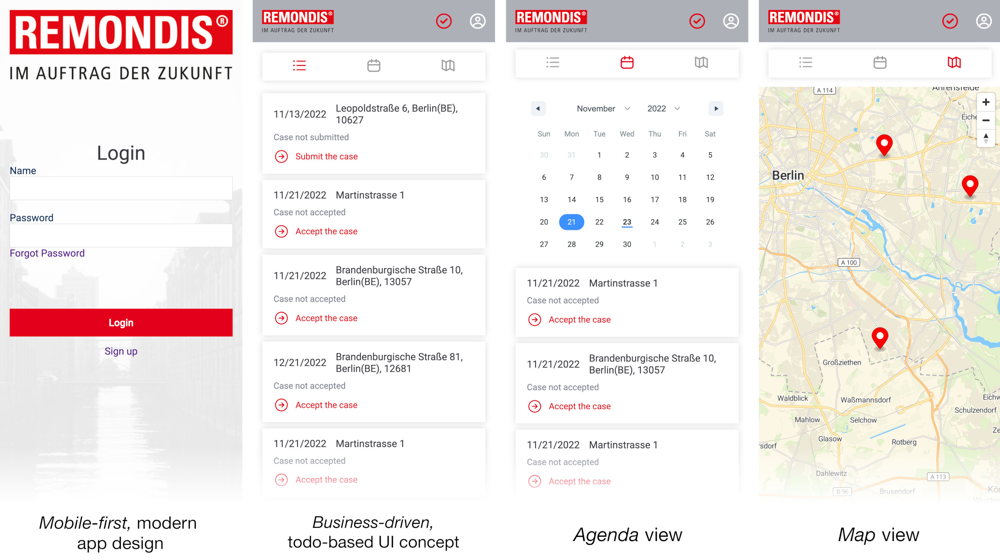

# WCS & REMONDIS GROUP

This project is a the result of a joint collaboration between _Wild Code School_ and _REMONDIS Group_

A group of 8 students worked along with their instructor to conceptualise and get as close as possible to building a working mobile app for their de-cluttering companies/partners

## State of Application

The application is at a _Proof of Concept_ (POC) level with some real and some mocked functionalities. The definition of either part can be found below:
1. _Real parts:_ these are parts that are implemented using a backend, the data provided to these parts of the application are stored in a database.
1. _Mocked parts:_ these are parts that are implemented without a backend, the data provided to these parts, hence, will be lost when refreshing the page.

For a detailed account of which functionalities are real and which are mocked, please check the [final presentation here](https://wildcodeschool.github.io/2022-07-EN-Berlin-Remote1-Project3Presentation/).

The presentation is a WIP, it will be finalized before the final demo on the graduation day (30.11.2022).

## Instructions

Below you will find instructions on how to run the fullstack application including both the backend, and the frontend.

### Before you start

Before attempting to run the application, you will need the `.env` secrets file to be shared with you, please send a request to the teacher at orwa.diraneyya@wildcodeschool.com

Let's begin!

---
### The Backend

Please find the steps to launch the backend below (note that you will need a secrets or a `.env` file):

1. Clone the [backend](https://github.com/WildCodeSchool/2022-07-EN-Berlin-Remote1-Project3Backend) repository and `cd` into it:
    ```bash
    git clone https://github.com/WildCodeSchool/2022-07-EN-Berlin-Remote1-Project3Backend REMONDISBackend
    cd REMONDISBackend
    ```
1. If using a node version other than 16.x, use `nvm` to switch to and/or install the right version:
    ```bash
    nvm install 16
    nvm use 16
    ```
1. Install the dependencies:
    ```bash
    npm i
    ```
1. Store the `.env` file (containing the secrets) in the root of the repository directory.
    > _NOTE:_ the variable `FRONTEND_URL` in the secrets file contains the URL pointing to the frontend, for example, when running the frontend locally, this is similar to `http://localhost:3000`
1. Run `npm start` to build and start the server.
1. In another console window, `cd` to the same folder and run the following command to explore the data in the local/remote database:
    ```bash
    npx prisma migrate dev
    ```
1. In case the command above did not work, run the following command first, then try again:
    ```bash
    npx prisma migrate dev
    ```

> For creating or migrating the database to a new location, change the `DATABASE_URL` variable in the secrets file to contain the connection string for new database location, then run following command:
> ```bash
> npx prisma migrate dev
> ```


For more details, please refer to the [README](https://github.com/WildCodeSchool/2022-07-EN-Berlin-Remote1-Project3Backend/blob/main/README.md) of the backend project on GitHub.


---
### The Frontend

Please find the steps to launch the frontend:

1. Clone the [frontend](https://github.com/WildCodeSchool/2022-07-EN-Berlin-Remote1-Project3Frontend) repository and `cd` into it:
    ```bash
    git clone https://github.com/WildCodeSchool/2022-07-EN-Berlin-Remote1-Project3Frontend REMONDISFrontend
    cd REMONDISFrontend
    ```
1. If using a node version other than 16.x, use `nvm` to switch to and/or install the right version:
    ```bash
    nvm install 16
    nvm use 16
    ```
1. Install the dependencies:
    ```bash
    npm i
    ```
1. Create a blank secrets file at the root of the repository directory, name the file `.env`, and add the following line to it:
    ```
    REACT_APP_BASE_API_URL=http://localhost:4000
    ```
1. As shown above, the variable named `REACT_APP_BASE_API_URL`in the secrets file schould point to the backend.
1. Run `npm start` script to build and start the frontend application.

---

### Questions

For any questions until the demo day, please do not hesitate to reach out on the [Rocket Chat channel](https://chat.wilders.dev/group/RemoteDE_Real_client_project_with_RemondisDigital)

For inquiries after that, please email the instructor at orwa.diraneyya@wildcodeschool.com

To communicate with the students, either to offer employment or internship opportunities, please contact them directly. Personal emails will be provided upon request.

---

### Links

More information and details (including extensive design documentation and links) can be found in the [planning document](./PLANNING.md) in this rep.