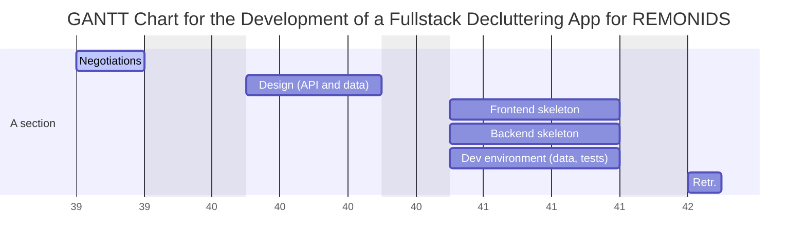
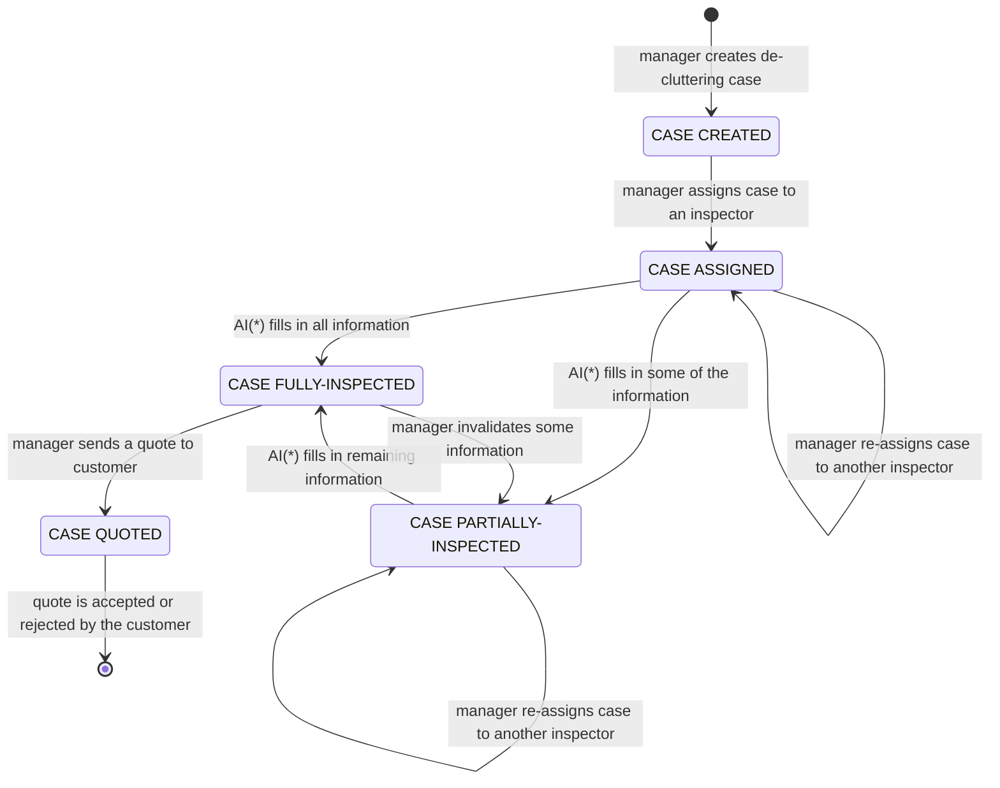

# 2022-07-EN-Berlin-Remote1-Project3Planning
Contains the planning and the design documentation for the industry project with REMONDIS group.

# Planning

## Timeline (WIP)

> National holidays:
> - Monday 03.10.2022 (Week 40) -_Day of German Unity_

## Teams

- _Architects_: people who devise the "schema" of data layers and "endpoints" of API interfaces. In later stages they help create a development environment for other teams including providing sample data, unit tests, demanding architectural changes (i.e. refactoring), and monitoring code quality overall.
- _Designers_: people who devise the LoFi wireframes in the beginning of the project. In later stages they do the actual design including the Figma mockups. Upon approval they move to providing the styled components (writing CSS from scratch or using any framework/library they deem appropriate). These people will also look after useability and responsive design, it is a massive job.
- _Frontend_: people who use React.js or Next.js in any way they deem appropriate to build the logic of the frontend (i.e. browser) application. They are responsible for the offering a great functional experience. Using local storage, form constraints, and a great camera experience on mobile for the _inspector_ user role. The use of any state manager or form validation library is allowed and encouraged.
- _Backend_: people who use Express, Fastify or any other NodeJS framework to build the backend while implementing the API precisely as designed by the _architects_.

# Design

## User roles

- _Manager_: is the user role capable of creating new cases
- _Inspector_: is the user role capable of filling in "inspection data" into a case that they reserved

## Case state diagram

(*): AI stands for the _assigned inspector_

## Inspection data fields

_TODO_

## REST API design

To be provided using OpenAPI (i.e. Swagger).

## Database Schema

_TODO_
