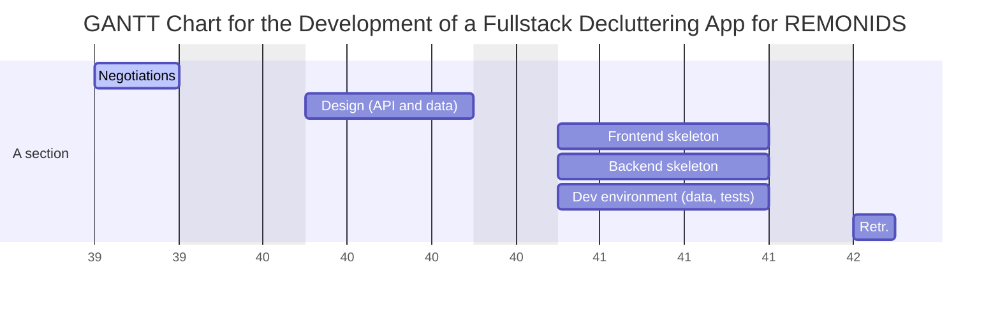
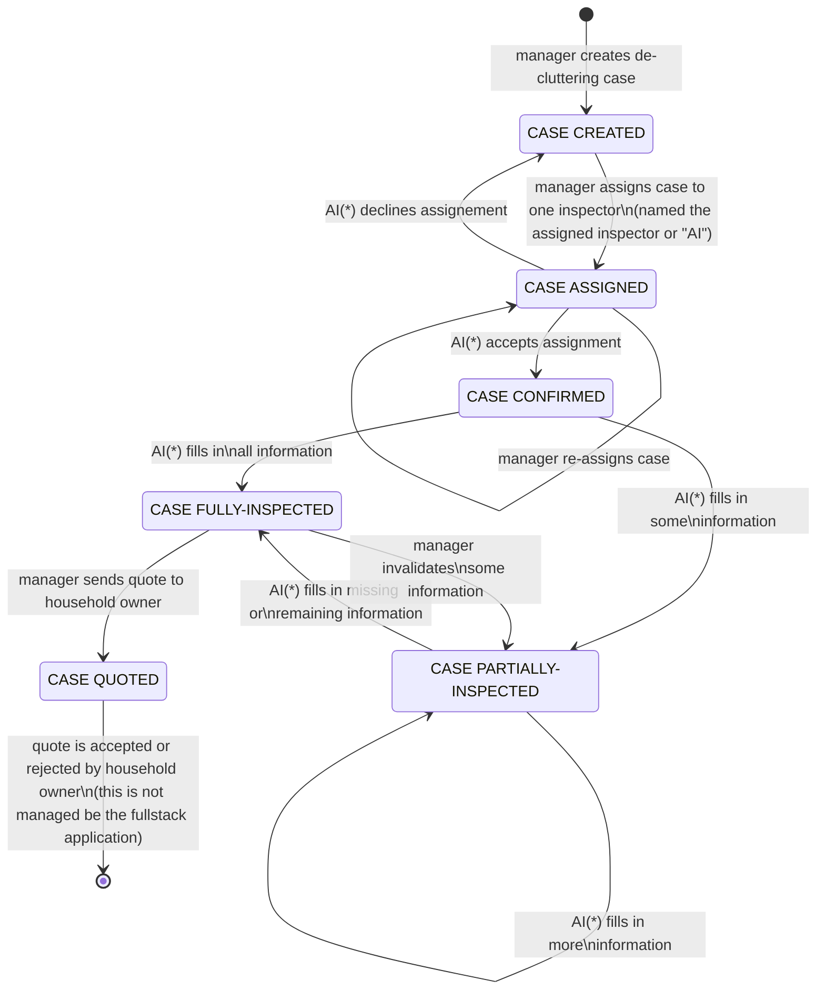

# 2022-07-EN-Berlin-Remote1-Project3Planning
Contains the planning and the design documentation for the industry project with REMONDIS group.

# Planning

## Timeline (WIP)

> National holidays:
> - Monday 03.10.2022 (Week 40) -_Day of German Unity_

## Teams

- _Architects_: people who devise the "schema" of data layers and "endpoints" of API interfaces. In later stages they help create a development environment for other teams including providing sample data, unit tests, demanding architectural changes (i.e. refactoring), and monitoring code quality overall.
- _Designers_: people who devise the LoFi wireframes in the beginning of the project. In later stages they do the actual design including the Figma mockups. Upon approval they move to providing the styled components (writing CSS from scratch or using any framework/library they deem appropriate). These people will also look after useability and responsive design, it is a massive job.
- _Frontend_: people who use React.js or Next.js in any way they deem appropriate to build the logic of the frontend (i.e. browser) application. They are responsible for the offering a great functional experience. Using local storage, form constraints, and a great camera experience on mobile for the _inspector_ user role. The use of any state manager or form validation library is allowed and encouraged.
- _Backend_: people who use Express, Fastify or any other NodeJS framework to build the backend while implementing the API precisely as designed by the _architects_.

# Design

## User roles

User roles are defined as a sets of distinct user permissions.

Some examples of user permissions are:
- _The permission to_ create a new de-cluttering case
- _The permission to_ assign an existing de-cluttering case to an inspector
- _The permission to_ reject a case that had been assigned to the user by another user

### Role descriptions

- _Manager_: is the user role capable of creating new de-cluttering cases
- _Inspector_: is the user role capable of filling in "inspection information" into a de-cluttering case that he/she is assigned to

### Venn diagram

#### Definitions

- _manager rights_: Are the user permissions acquired by the manager role, but not the inspector role
- _inspector rights_: Are the user permissions acquired by both the manager role and the inspector role

## Case state diagram

The following diagram illustrates the different states that a _de-cluttering case_ can be in throughout its lifecyle in the de-cluttering fullstack application being developed.

(*): AI stands for the _assigned inspector_

### Notes

The starting and ending points of the state diagram (i.e. the two _terminal points_ above) encompass the _scope_ of the fullstack application which is being developed.

Namely, the following things are outside the scope of the fullstack application:
- Getting de-cluttering leads/contacts
- Issuing de-cluttering quotes
- Following up on issued quoted and re-issuing altered quotes
- Payment collection and de-cluttering confirmation
- Planning and execution of the de-cluttering itself
- Any later procedures following the de-cluttering itself

## Inspection information

_TODO_

## REST API design

To be provided using OpenAPI (i.e. Swagger).

## Database Schema

_TODO_
