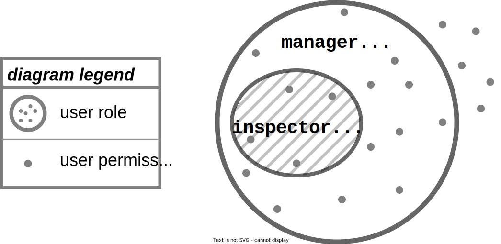

# Links

1. Kanban link (Project on GitHub): https://github.com/orgs/WildCodeSchool/projects/37
2. Backend repository: https://github.com/WildCodeSchool/2022-07-EN-Berlin-Remote1-Project3Backend
3. Frontend repository: https://github.com/WildCodeSchool/2022-07-EN-Berlin-Remote1-Project3Frontend
4. Provisional REST API endpoints: https://fastify-swagger-api.glitch.me/docs/static/index.html#/

# 2022-07-EN-Berlin-Remote1-Project3Planning
Contains the planning and the design documentation for the industry project with REMONDIS group.

# Planning

## Timeline (WIP)


> National holidays:
> - Monday 03.10.2022 (Week 40) -_Day of German Unity_

## Teams

- _Architects_: people who devise the "schema" of data layers and "endpoints" of API interfaces. In later stages they help create a development environment for other teams including providing sample data, unit tests, demanding architectural changes (i.e. refactoring), and monitoring code quality overall.
- _Designers_: people who devise the LoFi wireframes in the beginning of the project. In later stages they do the actual design including the Figma mockups. Upon approval they move to providing the styled components (writing CSS from scratch or using any framework/library they deem appropriate). These people will also look after useability and responsive design, it is a massive job.
- _Frontend_: people who use React.js or Next.js in any way they deem appropriate to build the logic of the frontend (i.e. browser) application. They are responsible for the offering a great functional experience. Using local storage, form constraints, and a great camera experience on mobile for the _inspector_ user role. The use of any state manager or form validation library is allowed and encouraged.
- _Backend_: people who use Express, Fastify or any other NodeJS framework to build the backend while implementing the API precisely as designed by the _architects_.

# Design

## User roles

A person can only make use of the fullstack application by having a user account, which assigns the "user" (i.e. person in charge of the account) to a specific "user role".

Technically speaking, a _user role_ is a collection of user permissions on the app.

Some examples of permissions are:
- _The permission to_ create a new de-cluttering case in the app
- _The permission to_ assign an existing de-cluttering case to a user in the app
- _The permission to_ reject a case that had been assigned to the user by another user in the app
- _The permission to_ delete a user account and all of the cases associated with the user account

> _Note that when decribing permissions, it is important to maintain a role-agnostic wording_ (e.g. the user, another user, etc.).
> 
> This way, the permissions _remain independent from the user roles,_ allowing us to change the mapping between the two as needed in response to change in the user requirements.

### Role descriptions

- _Manager_: is the user role capable of creating new de-cluttering cases
- _Inspector_: is the user role capable of filling in "inspection information" into a de-cluttering case that he/she is assigned to

### Venn diagram



#### Definitions

- _developer rights_: Are the user permissions not granted to any user role in the app
- _manager rights_: Are the user permissions acquired by the manager role, but not the inspector role
- _inspector rights_: Are the user permissions acquired by both the manager role and the inspector role

## State-machine descriptions

Many systems can be modelled as _state machines_. Despite the name, a system that is modelled as a state machine does not need to be implented in hardware (i.e. as a physical machine). Namely, it is just for us to describe _deterministic behavior_ in a very clear and an unambiguous way.

The fullstack application to be developed have two main types of statefull entitites:
1. User accounts
2. De-cluttering cases

The behavior of these entities is described using two state diagrams, in the following subsections.

### User account states

The following diagram illustrates the different states of a _user account_, regardless of the user role assigned to this account.


#### Account creation/redemption sequence diagrams


### De-cluettering case states

The following diagram illustrates the different states that a _de-cluttering case_, and the transitions from and to the different states based on the interactions between the users of the platform and the case in the diagram.

Note that the diagram focusses on the lifecycle of the _de-cluttering_ within the scope of the fullstack application being developed, only. Namely, we are only concerned with the states of the case as it lives through the fullstack application. 


(*): AI stands for the _assigned inspector_

#### Interactive state diagram

Can be found at [this link](https://stately.ai/registry/editor/313df10f-254d-43a4-8347-84590a893cd4?machineId=0a5c01b4-2652-4178-a2ef-1fd5db6a0657) (Press the _simulate_ button on the page to see how this works)

#### XSTATE State Machine Description

```typescript
createMachine({
      "id": "Decluttering-Case State Diagram",
  "initial": "Created",
  "states": {
    "Created": {
      "on": {
        "Manager assigns case": {
          "target": "Assigned"
        },
        "Manager closes": {
          "target": "Closed"
        }
      }
    },
    "Assigned": {
      "on": {
        "Inspector declines": {
          "target": "Created"
        },
        "Inspector accepts": {
          "target": "Confirmed"
        },
        "Manager closes": {
          "target": "Closed"
        },
        "Manager reassigns": {}
      }
    },
    "Confirmed": {
      "on": {
        "Inspector completes data": {
          "target": "Ready"
        },
        "Inspector fills data": {
          "target": "Ongoing"
        },
        "Manager closes": {
          "target": "Closed"
        }
      }
    },
    "Closed": {},
    "Ongoing": {
      "on": {
        "Inspector completes data": {
          "target": "Ready"
        },
        "Manager closes": {
          "target": "Closed"
        }
      }
    },
    "Ready": {
      "on": {
        "Manager sends quote": {
          "target": "Quoted"
        }
      }
    },
    "Quoted": {}
  }
,
    schema: {
      context: {} as {
        
      },
      events: {} as {"type": "Manager assigns case"}| {"type": "Manager sends quote"}| {"type": "Inspector completes data"}| {"type": "Inspector declines"}| {"type": "Inspector accepts"}| {"type": "Manager closes"}| {"type": "Inspector fills data"}| {"type": "Manager reassigns"}
    },
   context: {},
   predictableActionArguments: true,
   preserveActionOrder: true,
  })
```

### Notes

The starting and ending points of the state diagram (i.e. the two _terminal points_ above) encompass the _scope_ of the fullstack application which is being developed.

Namely, the following things are outside the scope of the fullstack application:
- Getting de-cluttering leads/contacts
- Issuing de-cluttering quotes
- Following up on issued quoted and re-issuing altered quotes
- Payment collection and de-cluttering confirmation
- Planning and execution of the de-cluttering itself
- Any later procedures following the de-cluttering itself

## Inspection information

_TODO_

## REST API design

To be provided using OpenAPI (i.e. Swagger).
Find documentation [here](https://fastify-swagger-api.glitch.me/docs/static/index.html)

## Database Schema

_IN_PROGRESS_


